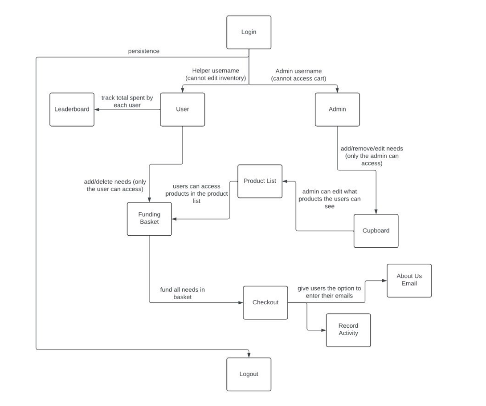
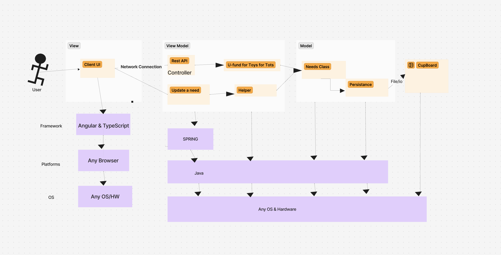
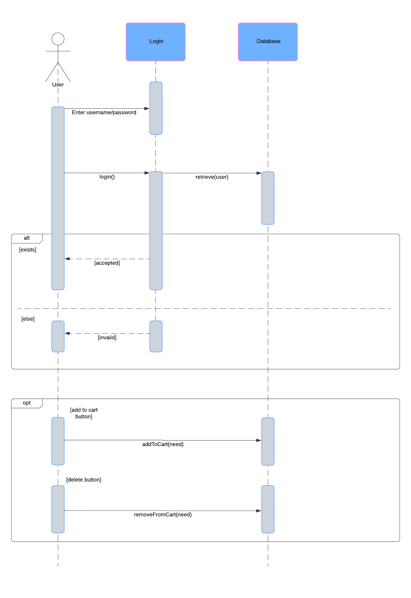
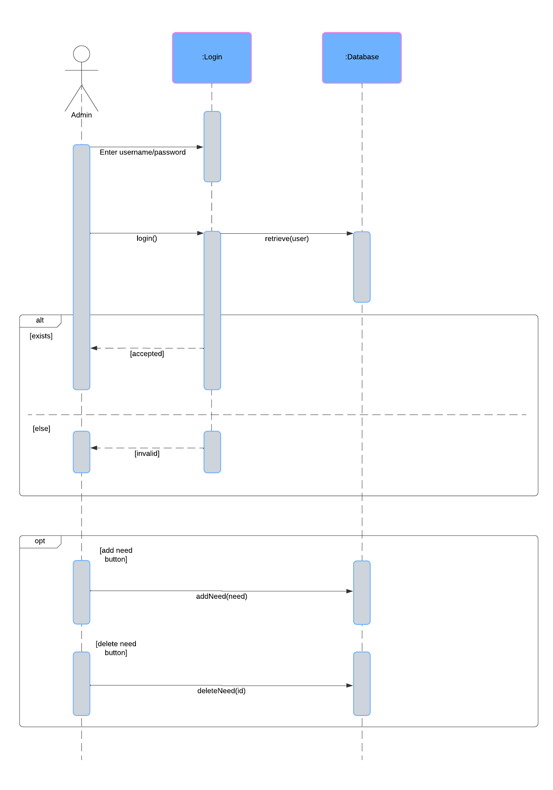
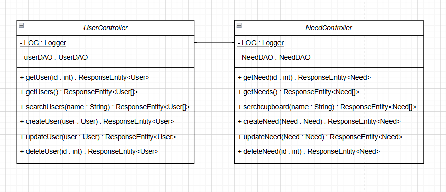
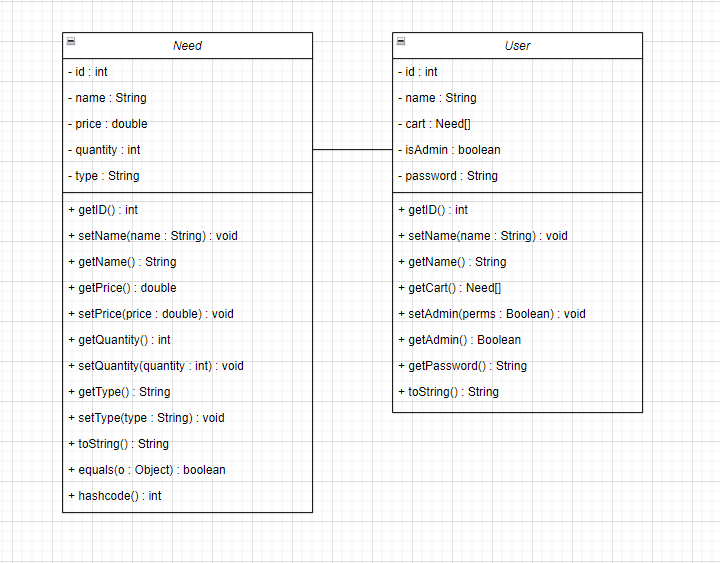
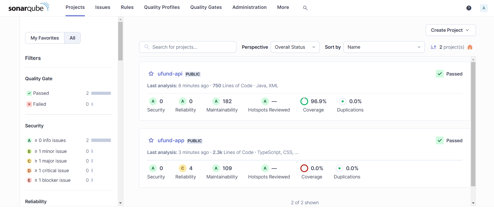
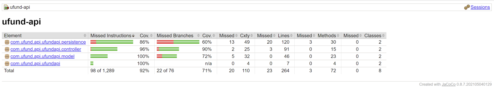
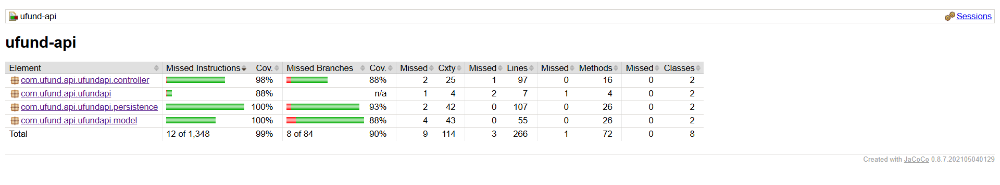

# PROJECT Design Documentation

## Team Information
* Team name: Team 1A
* Team members
  * Vivian Hernandez
  * Ryan Miner
  * Saumya Dhayal
  * Fariha Khan

## Executive Summary

Our project is a UFund website that aims to create an accessible space for individuals to donate items such as clothing, toys, school supplies, and other necessities for orphanages. The platform simplifies the donation process and ensures that users have full control over their contributions.

### Purpose

This website provides a user-friendly platform that makes it easy for people to donate items to support orphanages. The main user groups are donors, who aim to contribute items through an easy browsing and checkout process, and admins, who manage the cupboard based on inventory. The platform also tracks user contributions, providing recognition through a leaderboard system, and keeps users enaged through informative emails.

### Glossary and Acronyms

| Term | Definition |
|------|------------|
| SPA | Single Page |

## Requirements

1. Create a login and logout

As a User/Developer I want a user to be able to login and logout of my account so that I can keep record of my history.

2. Helper search for a need and add/remove needs from the Funding Basket

AS a User I WANT have the ability to search for, add, and remove needs from my funding basket SO THAT I am easily able to donate the items I want to.

3. U-fund Manager add/remove/edit cupboard

AS a Developer I WANT to have access to the cupboard SO THAT I can add, remove, and edit the contents in the cupboard.

### Definition of MVP

The minimum viable product for this sprint is a fully functioning website that includes the features necessary for all 
user and admin interaction. This includes user and admin login and logout, ability to add, delete, and edit cupboard and funding basket items when logged into the corresponding accounts. The 10% enhancements have also been completed, which were a leaderboard of the users with the highest contributions and an option for users to enter their emails to recieve an about us email. The UI has also been improved so that the website is easy to navigate.

### MVP Features
- As a user I want to be able to log in so that I can use the website.
- As an admin I want to be able to log in so that I can use the website.
- As a user I want to be able to add, remove, and edit items in my funding basket so that I can purchase the items that I want to.
- As an admin I want to be able to add, remove, and edit items in the cupboard so that I can keep the product list up to date with the inventory.
- As a user I want to be able to checkout the items I have selected in my funding basket so that I can donate the items that I want to.
- As a user I want to be able to log out so that I can leave the website when I am done shopping.
- As a user I want to have my activity recorded so that I can pick up where I left off when shopping.
- As an admin I want to be able to log out so that I can leave the website when I am done editing the cupboard.

### Enhancements
**About us email:**
Our website sends an about us email to users who enter their email after checking out.

**Donations Leaderboard:**
The website will include a leaderboard of who has contributed the most to our website.

## Application Domain

This domain model outlines all functionalities of the website. Users or admins begin by logging in with their username and password if they have an existing account. If not, they can create a new account through the sign-up option.

For users, successful login redirects them to the user page, displaying all items in the product list. Users can browse through and filter items by price or type. A leaderboard tab shows the users ranked by their total contributions to the website. While browsing, users can add items to their donation basket, which can be edited or cleared as needed. Once all desired items and quantities are selected, users can proceed to checkout to donate the items. The donation amount is tracked to update their leaderboard ranking. After checkout, users are given an option to provide their email to receive an About Us email. They can then continue browsing or log out.

For admins, login redirects to the admin page, which includes the items in the cupboard. Admins are able to add, delete, or edit items in the cupboard based on inventory needs. These changes update the product list displayed to users. Admins can log out after completing their updates.

## Architecture and Design

The UFund website follows the MVVM (Model-View-ViewModel) architecture. The frontend, built with Angular and TypeScript, provides a user-friendly interface (UI) accessible from any browser and operating system. The UI communicates with the backend through a REST API, which acts as a controller. The ViewModel layer processes these requests and interacts with the model layer, which handles persistence and data storage. Both the frontend and backend are designed to work on any platform, with Java powering the backend.

### Summary

The following Tiers/Layers model shows a high-level view of the webapp's architecture. 

The web application, is built using the Model–View–ViewModel (MVVM) architecture pattern. 

The Model stores the application data objects including any functionality to provide persistance. 

The View is the client-side SPA built with Angular utilizing HTML, CSS and TypeScript. The ViewModel provides RESTful APIs to the client (View) as well as any logic required to manipulate the data objects from the Model.

Both the ViewModel and Model are built using Java and Spring Framework. Details of the components within these tiers are supplied below.

### Overview of User Interface

The user is first presented with a login page, where they have to type in their account information to be able to view the contents of the website. Once logged in, they will be able to see the product list, which includes all the needs in the cupboard. They are able to select items and add them to their funding basket if they would like to donate that item. They are also given the ability to edit or remove contents in their funding basket. Once they are done adding all the needs they want to donate to their funding basket, they can checkout and donate their selected items. The user is then able to browse the page and log out when desired. After logging out, they will be rerouted to the login page.

### View Tier
The View Tier UI of the website architecture serves as the user interface, where users and admins interact with the platform. It is designed to be intuitive and responsive, ensuring a smooth experience for both user groups.

For users, the UI includes the login/sign-up forms, which provide secure access to the platform. Upon successful login, the user dashboard displays the product list, which can be filtered by type or price using interactive filters. The shopping cart interface allows users to add or remove items, edit quantities, and proceed to checkout. After donating, users are given the option to provide their emails for an informative email about our goals. The UI also includes a leaderboard, which displays a ranked list of top contributors to encourage user engagement.

For admins, the View Tier includes an admin dashboard with controls for managing the cupboard inventory. The add, delete, and update buttons enable admins to update the product list, ensuring the inventory reflects the current needs. The UI is structured to allow admins to log out once their tasks are completed.

Overall, the View Tier UI organizes and simplifies interactions, allowing users and admins to use the wesite as intended for thier groups while maintaining a consistent design and workflow. It ensures the platform is accessible and effective, supporting the goals of item donation and inventory management.

The first sequence diagram shows the process of a user logging in and managing their shopping cart. It demonstrates how the addToCart and removeFromCart methods allow the user to add or remove items, so that they can adjust their cart contents as needed.

The second sequence diagram shows the flow of an admin logging in and managing the cupboard inventory. Using the addNeed and deleteNeed methods, the admin can update the inventory by adding or removing items as required.

### ViewModel Tier

**NeedDAO.java:** This defines the interface for accessing and manging data related to the needs.It provides method signatures for creating, reading, updating, and deleting needs.

**NeedFileDAO.java:** This class implements the methods in the NeedDAO interface. This manages how needs are stored and retrieved from the storage file.

### Model Tier

**Need.java:** This class represents the model for a need. It defines the attributes and structure and includes methods to manage components of the need.

**User.java:** This class defined the attributes of the users. It involves methods to get and set the names, get the password, and manage other components of the user.

## OO Design Principles

**Sprint 1**

**Dependency Inversion:** 
With Dependency Inversion, we have focused on abstracting the user model, which allows higher-level modules to depend on abstractions rather than on specific, concrete implementations. This not only enhances flexibility but also makes it easier to extend or modify individual components without affecting the rest of the system.

**Law of Demeter and Single Responsibilty:**
The Law of Demeter and the Single Responsibility Principle work hand-in-hand to promote low coupling and modular design. By adhering to the Law of Demeter, we ensure that classes interact only with their direct dependencies, minimizing unnecessary knowledge of other parts of the system. This reduces the likelihood of unintended side effects when changes are made.

**Sprint 2**

**Single Responsibility:** 
Our team ensured that each class followed the Single Responsibility Principle by assigning one responsibility to each class. This simplifies the code structure, ensuring that the classes have a well defined purpose and reduces the likelihood of unexpected side effects when adding functionalities in the future.

**Law of Demeter:**
For this sprint, classes were only dependent on each other if they were directly related, in order to prevent high coupling. This prevents complex dependencies from forming, which can lead to issues where a change in one class affects multiple unrelated classes and gives unintended functionalities to parts of the system. Our adherence to this law ensures that changes within a class will have minimal impact on other classes.

**Sprint 3**

**Open/Closed:**
This sprint involved editing files that other developers had worked on previously. In order to prevent functionalities that had previously been working, we used the open/closed principle, meaning that the modules were open for extension and closed for modification. When it was necessary to edit a module that had already been written and tested, the developers added the functionalities, but did not edit the content that had already been written and tested.

**Controller:**
Sprint 3 worked more with controller to handle the interacttion between incoming requests and the working of the system. The controller class was responsible for handling system events to their dedicated classes in order to manage and coordinate the systems behavior.

## Static Code Analysis/Future Design Improvements

The SonarQube tests gave the expected results. Below are the flagged areas identified.
- Unexpected duplicate "padding"
- Do not use "Set" to declare a parameter - use another name.
- 'price' is assigned to itself.
- 'quantity' is assigned to itself.

The flagged issues reflect areas where small improvements can significantly enhance code quality. Making these changes would improve the code, but the test results show that the overall code has the correct functionalities with good coding format.
 
 If we had more time, our team would improve our UI and make the website look more presentable. We got all the necessary functionalities and got the UI to be user friendly, but we would fix the aesthetic and look of the website more if given more time to do so.

## Testing

Unit tests were made for each component in the model, persistence, and controller components. Tests were made for each method in every file in order to test every part of the code. The tests all ran successfully, meaning the code was well written for the functionalities that were completed.

### Acceptance Testing

This sprint had more successful code coverage, as it reached 90%. All of the methods written in java were tested to ensure the correct functionality, which is shown in the 99% coverage. Tests were written for all possible cases of each method, but a few cases were missed, which is why the code coverage was at 90% instead of 100%. More specifically, in the model tier, the equals methods for the user and needs classes were missing some cases in the equals methods, the user controller class was missing cases for the create and search user methods, and the persistence tier was missing a few test cases for the load methods of the UserFileDAO and NeedFileDAO. Although these methods were missing some test cases, the overall code coverage was at 90%, meaning the code was written correctly for the tasks being done.

### Unit Testing and Code Coverage

**Sprint 2:**

All the tiers had 100% coverage, except for the persistence and controller. This is because in the persistence tier, the equals and hashcode methods weren't tested, but the functionality of the class was correct.

**Sprint 3 and 4:**

As shown in the code coverage report, the code had 90% coverage, meaning most of the methods were tested and all the cases that were tested passed.

## Ongoing Rationale

**(2024/10/15) Sprint 2:** 10% enhancements were decided to be thank you emails sent to each user after donating and tracking and displaying the number of donations each user has made.

**(2024/11/09) Sprint 3:** UI design was mapped out to make a cleaner and more easily accessible website.

**(2024/11/11) Sprint 3:** Switched 10% enhancement from thank you email to an about us email to users after they check out. Users can choose whether they would like the email or not.